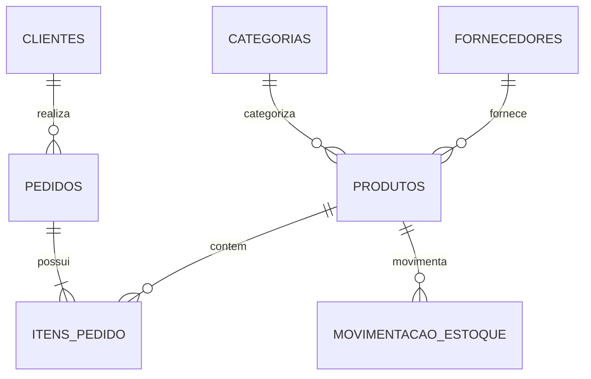

# 📊 Projeto de Análise de E-commerce com PostgreSQL


## 🎯 Objetivo
Projeto completo de estudo prático de PostgreSQL, abrangendo desde a criação do banco de dados até análises avançadas de dados de e-commerce.

## 📚 Índice
1. [Estrutura do Banco de Dados](#-estrutura-do-banco-de-dados)
2. [Dados de Teste](#-dados-de-teste)
3. [Análises Implementadas](#-análises-implementadas)
4. [Como Executar](#-como-executar)
5. [Resultados e Insights](#-resultados-e-insights)

## 🗃️ Estrutura do Banco de Dados

### Diagrama ER


### Tabelas Principais
1. **Fornecedores**: Cadastro e avaliação de fornecedores
2. **Categorias**: Classificação dos produtos
3. **Clientes**: Dados e métricas dos clientes
4. **Produtos**: Catálogo completo de produtos
5. **Pedidos**: Registro de vendas
6. **Itens_Pedido**: Detalhamento dos pedidos
7. **Movimentacao_Estoque**: Controle de estoque

## 📥 Dados de Teste

### Volume de Dados
- 5 Fornecedores
- 5 Categorias
- 5 Clientes
- 100 Produtos
- 50 Pedidos
- 150 Itens de Pedido
- 200 Movimentações de Estoque

### Distribuição dos Dados
- **Status de Pedidos**: Distribuição uniforme entre estados
- **Formas de Pagamento**: Distribuição uniforme entre métodos
- **Margens de Lucro**: Variação por categoria (30% a 70%)

## 📊 Análises Implementadas

### 1. Produtos Mais Vendidos
```sql
WITH vendas_produto AS (
    SELECT 
        p.id,
        p.nome,
        c.nome as categoria,
        COUNT(DISTINCT ip.pedido_id) as total_pedidos,
        SUM(ip.quantidade) as quantidade_vendida
        -- ... outros campos
)
```
**Objetivo**: Identificar best-sellers e padrões de venda

### 2. Margens de Lucro por Categoria
```sql
WITH margem_categoria AS (
    SELECT 
        c.nome as categoria,
        COUNT(DISTINCT p.id) as total_produtos,
        ROUND(AVG(p.margem_lucro)::numeric, 2) as margem_media
        -- ... outros campos
)
```
**Objetivo**: Análise de rentabilidade por segmento

### 3. Tempo Médio de Entrega
```sql
WITH metricas_entrega AS (
    SELECT 
        status,
        COUNT(*) as total_pedidos,
        ROUND(AVG(prazo_entrega)::numeric, 1) as prazo_medio_prometido
        -- ... outros campos
)
```
**Objetivo**: Monitoramento de performance logística

### 4. Análise RFM (Recência, Frequência, Monetário)
```sql
WITH metricas_cliente AS (
    SELECT 
        c.id,
        c.nome,
        CURRENT_DATE - MAX(p.data_pedido)::date as recencia_dias
        -- ... outros campos
)
```
**Objetivo**: Segmentação avançada de clientes

### 5. Previsão de Reposição de Estoque
```sql
WITH consumo_mensal AS (
    SELECT 
        produto_id,
        -SUM(CASE 
            WHEN tipo_movimento = 'saída' THEN quantidade
            ELSE 0
        END) as quantidade_vendida
        -- ... outros campos
)
```
**Objetivo**: Gestão proativa de estoque

## 🚀 Como Executar

### 1. Preparação do Ambiente
```bash
# Criar banco de dados
createdb ecommerce_db

# Conectar ao banco
psql -d ecommerce_db
```

### 2. Execução dos Scripts
```sql
-- 1. Criar estrutura
\i 01_create_tables.sql

-- 2. Inserir dados
\i 02_insert_data.sql

-- 3. Executar análises
\i 03_analysis_queries.sql
```

## 📈 Resultados e Insights

### 1. Performance de Produtos
- Identificação de produtos mais rentáveis
- Análise de correlação entre preço e volume de vendas
- Mapeamento de categorias em crescimento

### 2. Comportamento de Clientes
- Segmentação RFM
- Padrões de compra
- Lifetime Value

### 3. Eficiência Operacional
- Métricas de entrega
- Gestão de estoque
- Performance de fornecedores

## ⚡ Otimizações

### 1. Índices Recomendados
```sql
CREATE INDEX idx_produtos_categoria ON produtos(categoria_id);
CREATE INDEX idx_pedidos_cliente ON pedidos(cliente_id);
CREATE INDEX idx_pedidos_data ON pedidos(data_pedido);
```

### 2. Views Materializadas
```sql
CREATE MATERIALIZED VIEW mv_vendas_diarias AS
-- Query de análise de vendas
WITH (data-checks=true);
```

## 📊 Visualizações Sugeridas

### 1. Dashboard de Vendas
```
Vendas por Categoria
│
├─ Eletrônicos    ████████████ R$ 1.000.000
├─ Moda           ████████     R$ 800.000
└─ Acessórios     ████         R$ 400.000
```

### 2. Matriz RFM
```
R/F │ 1   2   3   4   5
────┼───────────────────
  5 │ 🔴 🔴 🟡 🟢 🟢
  4 │ 🔴 🟡 🟡 🟢 🟢
  3 │ 🔴 🟡 🟡 🟡 🟢
```

## 🔄 Manutenção

### 1. Rotinas Diárias
```sql
-- Atualizar views materializadas
REFRESH MATERIALIZED VIEW mv_vendas_diarias;

-- Vacuum análises
VACUUM ANALYZE produtos, pedidos, itens_pedido;
```

### 2. Monitoramento
```sql
-- Verificar tamanho das tabelas
SELECT relname, pg_size_pretty(pg_total_relation_size(relid))
FROM pg_stat_user_tables;
```

## 👤 Metadados
- **Desenvolvedor**: nedio-junior
- **Última Atualização**: 2025-02-21 04:52:55 UTC
- **Versão**: 1.0.0

## 📫 Suporte
- Email: [seu-email@dominio.com]
- GitHub: [@nedio-junior](https://github.com/nedio-junior)

## 📝 Changelog

### v1.0.0 (2025-02-21)
- ✅ Criação da estrutura do banco
- ✅ Implementação das análises
- ✅ Documentação completa
- ✅ Otimizações de performance

## 📚 Referências
- [PostgreSQL Documentation](https://www.postgresql.org/docs/)
- [Modern SQL Guide](https://modern-sql.com/)
- [Database Design Guide](https://www.datablist.com/learn/postgresql)

---
© 2025 Projeto E-commerce Analytics - Desenvolvido por nedio-junior
