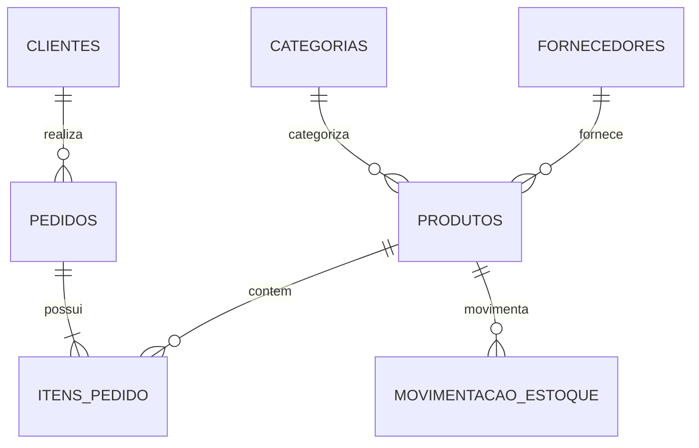
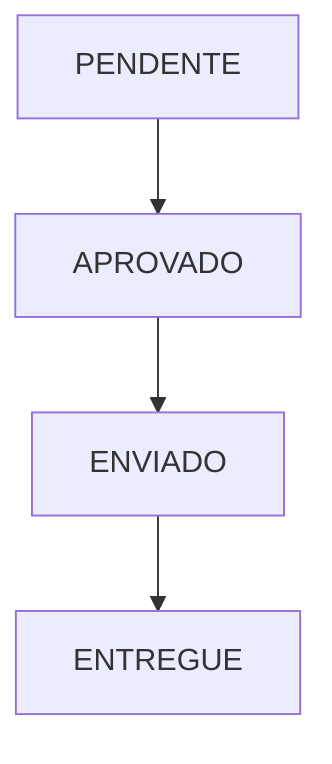
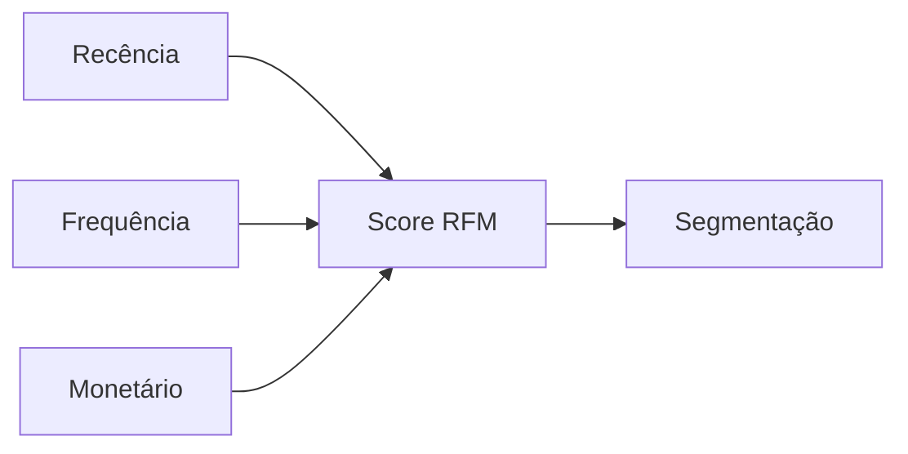
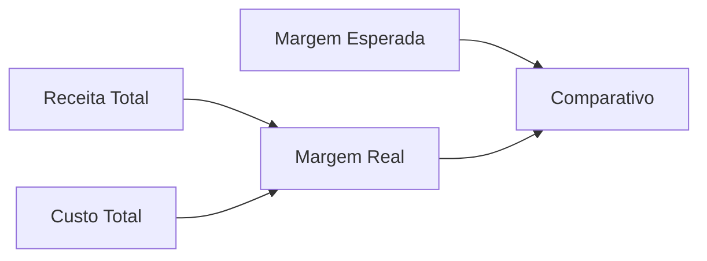
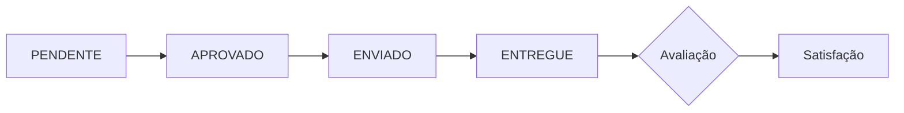
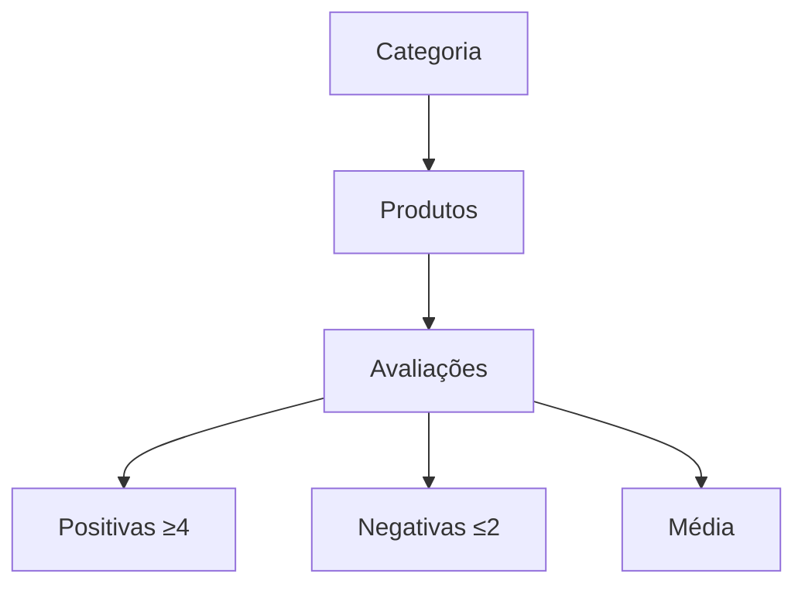
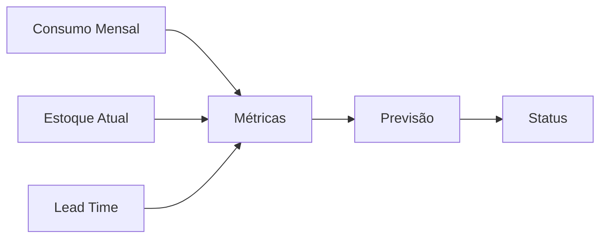

# 📊 Projeto de Análise de E-commerce com PostgreSQL


## 🎯 Objetivo
Projeto completo de estudo prático de PostgreSQL, abrangendo desde a criação do banco de dados até análises avançadas de dados de e-commerce.

## 📚 Índice
1. [Estrutura do Banco de Dados](#-estrutura-do-banco-de-dados)
2. [Dados de Teste](#-dados-de-teste)
3. [Análises Implementadas](#-análises-implementadas)
4. [Como Executar](#-como-executar)
5. [Resultados e Insights](#-resultados-e-insights)

## 🗃️ Estrutura do Banco de Dados

### Diagrama ER


### Tabelas Principais
1. **Fornecedores**: Cadastro e avaliação de fornecedores
2. **Categorias**: Classificação dos produtos
3. **Clientes**: Dados e métricas dos clientes
4. **Produtos**: Catálogo completo de produtos
5. **Pedidos**: Registro de vendas
6. **Itens_Pedido**: Detalhamento dos pedidos
7. **Movimentacao_Estoque**: Controle de estoque

## 📥 Dados de Teste

### Volume de Dados
- 5 Fornecedores
- 5 Categorias
- 5 Clientes
- 100 Produtos
- 50 Pedidos
- 150 Itens de Pedido
- 200 Movimentações de Estoque

### Distribuição dos Dados
- **Status de Pedidos**: Distribuição uniforme entre estados
- **Formas de Pagamento**: Distribuição uniforme entre métodos
- **Margens de Lucro**: Variação por categoria (30% a 70%)

## 📊 Análises Implementadas

### 1. Produtos Mais Vendidos
```sql
WITH vendas_produto AS (
    SELECT 
        p.id,
        p.nome,
        c.nome as categoria,
        COUNT(DISTINCT ip.pedido_id) as total_pedidos,
        SUM(ip.quantidade) as quantidade_vendida
        -- ... outros campos
)
```
**Objetivo**: Identificar best-sellers e padrões de venda

### 2. Margens de Lucro por Categoria
```sql
WITH margem_categoria AS (
    SELECT 
        c.nome as categoria,
        COUNT(DISTINCT p.id) as total_produtos,
        ROUND(AVG(p.margem_lucro)::numeric, 2) as margem_media
        -- ... outros campos
)
```
**Objetivo**: Análise de rentabilidade por segmento

### 3. Tempo Médio de Entrega
```sql
WITH metricas_entrega AS (
    SELECT 
        status,
        COUNT(*) as total_pedidos,
        ROUND(AVG(prazo_entrega)::numeric, 1) as prazo_medio_prometido
        -- ... outros campos
)
```
**Objetivo**: Monitoramento de performance logística

### 4. Análise RFM (Recência, Frequência, Monetário)
```sql
WITH metricas_cliente AS (
    SELECT 
        c.id,
        c.nome,
        CURRENT_DATE - MAX(p.data_pedido)::date as recencia_dias
        -- ... outros campos
)
```
**Objetivo**: Segmentação avançada de clientes

### 5. Previsão de Reposição de Estoque
```sql
WITH consumo_mensal AS (
    SELECT 
        produto_id,
        -SUM(CASE 
            WHEN tipo_movimento = 'saída' THEN quantidade
            ELSE 0
        END) as quantidade_vendida
        -- ... outros campos
)
```
**Objetivo**: Gestão proativa de estoque

## 🚀 Como Executar

### 1. Preparação do Ambiente
```bash
# Criar banco de dados
createdb ecommerce_db

# Conectar ao banco
psql -d ecommerce_db
```

### 2. Execução dos Scripts
```sql
-- 1. Criar estrutura
\i 01_create_tables.sql

-- 2. Inserir dados
\i 02_insert_data.sql

-- 3. Executar análises
\i 03_analysis_queries.sql
```

## 📈 Resultados e Insights

### 1. Performance de Produtos
- Identificação de produtos mais rentáveis
- Análise de correlação entre preço e volume de vendas
- Mapeamento de categorias em crescimento

### 2. Comportamento de Clientes
- Segmentação RFM
- Padrões de compra
- Lifetime Value

### 3. Eficiência Operacional
- Métricas de entrega
- Gestão de estoque
- Performance de fornecedores

## ⚡ Otimizações

### 1. Índices Recomendados
```sql
CREATE INDEX idx_produtos_categoria ON produtos(categoria_id);
CREATE INDEX idx_pedidos_cliente ON pedidos(cliente_id);
CREATE INDEX idx_pedidos_data ON pedidos(data_pedido);
```

### 2. Views Materializadas
```sql
CREATE MATERIALIZED VIEW mv_vendas_diarias AS
-- Query de análise de vendas
WITH (data-checks=true);
```

## 📊 Visualizações Sugeridas

### 1. Dashboard de Vendas
```
Vendas por Categoria
│
├─ Eletrônicos    ████████████ R$ 1.000.000
├─ Moda           ████████     R$ 800.000
└─ Acessórios     ████         R$ 400.000
```

### 2. Matriz RFM
```
R/F │ 1   2   3   4   5
────┼───────────────────
  5 │ 🔴 🔴 🟡 🟢 🟢
  4 │ 🔴 🟡 🟡 🟢 🟢
  3 │ 🔴 🟡 🟡 🟡 🟢
```

## 🔄 Manutenção

### 1. Rotinas Diárias
```sql
-- Atualizar views materializadas
REFRESH MATERIALIZED VIEW mv_vendas_diarias;

-- Vacuum análises
VACUUM ANALYZE produtos, pedidos, itens_pedido;
```

### 2. Monitoramento
```sql
-- Verificar tamanho das tabelas
SELECT relname, pg_size_pretty(pg_total_relation_size(relid))
FROM pg_stat_user_tables;
```

## 👤 Metadados
- **Desenvolvedor**: nedio-junior
- **Última Atualização**: 2025-02-21 04:52:55 UTC
- **Versão**: 1.0.0

## 📫 Suporte
- Email: [seu-email@dominio.com]
- GitHub: [@nedio-junior](https://github.com/nedio-junior)

## 📝 Changelog

### v1.0.0 (2025-02-21)
- ✅ Criação da estrutura do banco
- ✅ Implementação das análises
- ✅ Documentação completa
- ✅ Otimizações de performance

## 📚 Referências
- [PostgreSQL Documentation](https://www.postgresql.org/docs/)
- [Modern SQL Guide](https://modern-sql.com/)
- [Database Design Guide](https://www.datablist.com/learn/postgresql)

# Passo a Passo detalhado de cada etapa e de cada análise em ordem de construção do projeto

## 🛍️ Schema de Banco de Dados E-commerce


## 🎯 Objetivo
Esquema completo de banco de dados para sistema de e-commerce, incluindo gestão de produtos, pedidos, clientes, fornecedores e estoque.

## 📊 Diagrama ER


## 🗃️ Estrutura das Tabelas

### 1. Fornecedores
```sql
CREATE TABLE fornecedores (
    id SERIAL PRIMARY KEY,
    nome VARCHAR(100) NOT NULL,
    cnpj VARCHAR(14) UNIQUE NOT NULL,
    prazo_medio_entrega INTEGER,
    avaliacao_qualidade DECIMAL(3,2),
    data_cadastro TIMESTAMP DEFAULT CURRENT_TIMESTAMP
);
```

### 2. Categorias
```sql
CREATE TABLE categorias (
    id SERIAL PRIMARY KEY,
    nome VARCHAR(50) NOT NULL,
    descricao TEXT,
    margem_lucro_padrao DECIMAL(5,2),
    prazo_validade_medio INTEGER
);
```

### 3. Clientes
```sql
CREATE TABLE clientes (
    id SERIAL PRIMARY KEY,
    nome VARCHAR(100) NOT NULL,
    email VARCHAR(100) UNIQUE NOT NULL,
    cpf VARCHAR(11) UNIQUE NOT NULL,
    -- Outros campos
    nps INTEGER,
    data_cadastro TIMESTAMP DEFAULT CURRENT_TIMESTAMP
);
```

### 4. Produtos
```sql
CREATE TABLE produtos (
    id SERIAL PRIMARY KEY,
    sku VARCHAR(20) UNIQUE NOT NULL,
    nome VARCHAR(100) NOT NULL,
    -- Campos de relacionamento
    categoria_id INTEGER REFERENCES categorias(id),
    fornecedor_id INTEGER REFERENCES fornecedores(id),
    -- Campos de negócio
    preco_custo DECIMAL(10,2) NOT NULL,
    preco_venda DECIMAL(10,2) NOT NULL
);
```

### 5. Pedidos
```sql
CREATE TABLE pedidos (
    id SERIAL PRIMARY KEY,
    cliente_id INTEGER REFERENCES clientes(id),
    status VARCHAR(20) NOT NULL,
    -- Campos financeiros
    valor_produtos DECIMAL(10,2) NOT NULL,
    valor_frete DECIMAL(10,2) NOT NULL
);
```

## 🔍 Índices Recomendados

### 1. Índices de Busca
```sql
CREATE INDEX idx_produtos_categoria ON produtos(categoria_id);
CREATE INDEX idx_produtos_fornecedor ON produtos(fornecedor_id);
CREATE INDEX idx_pedidos_cliente ON pedidos(cliente_id);
CREATE INDEX idx_pedidos_status ON pedidos(status);
```

### 2. Índices de Performance
```sql
CREATE INDEX idx_produtos_sku ON produtos(sku);
CREATE INDEX idx_clientes_cpf ON clientes(cpf);
CREATE INDEX idx_movimentacao_data ON movimentacao_estoque(data_movimento);
```

## 📊 Constraints e Validações

### 1. Checks de Negócio
```sql
ALTER TABLE produtos
ADD CONSTRAINT check_precos
CHECK (preco_venda >= preco_custo);

ALTER TABLE pedidos
ADD CONSTRAINT check_valores
CHECK (valor_total = valor_produtos + valor_frete - valor_desconto);
```

### 2. Validações de Dados
```sql
ALTER TABLE clientes
ADD CONSTRAINT check_cpf
CHECK (length(cpf) = 11);

ALTER TABLE produtos
ADD CONSTRAINT check_estoque
CHECK (estoque_minimo <= estoque_maximo);
```

## 🔄 Triggers Sugeridos

### 1. Atualização de Estoque
```sql
CREATE TRIGGER atualiza_estoque
AFTER INSERT ON itens_pedido
FOR EACH ROW
EXECUTE FUNCTION atualiza_estoque_produto();
```

### 2. Histórico de Preços
```sql
CREATE TRIGGER log_alteracao_preco
BEFORE UPDATE OF preco_venda ON produtos
FOR EACH ROW
EXECUTE FUNCTION registra_historico_preco();
```

## 📈 Views Recomendadas

### 1. Resumo de Vendas
```sql
CREATE VIEW vw_resumo_vendas AS
SELECT
    p.categoria_id,
    COUNT(DISTINCT p.id) as total_pedidos,
    SUM(ip.quantidade * ip.preco_unitario) as valor_total
FROM pedidos p
JOIN itens_pedido ip ON p.id = ip.pedido_id
GROUP BY p.categoria_id;
```

### 2. Status de Estoque
```sql
CREATE VIEW vw_status_estoque AS
SELECT
    p.id,
    p.nome,
    p.estoque_atual,
    CASE
        WHEN p.estoque_atual <= p.estoque_minimo THEN 'CRÍTICO'
        WHEN p.estoque_atual <= p.estoque_minimo * 1.5 THEN 'ATENÇÃO'
        ELSE 'NORMAL'
    END as status_estoque
FROM produtos p;
```

## 🔒 Segurança

### 1. Roles e Permissões
```sql
CREATE ROLE vendedor;
GRANT SELECT ON produtos TO vendedor;
GRANT INSERT ON pedidos TO vendedor;

CREATE ROLE estoquista;
GRANT SELECT, UPDATE ON produtos TO estoquista;
GRANT INSERT ON movimentacao_estoque TO estoquista;
```

### 2. Políticas de Acesso
```sql
ALTER TABLE pedidos ENABLE ROW LEVEL SECURITY;
CREATE POLICY vendedor_policy ON pedidos
    FOR SELECT
    TO vendedor
    USING (vendedor_id = current_user_id());
```

## 📋 Manutenção

### 1. Vacuum e Analyze
```sql
-- Executar periodicamente
VACUUM ANALYZE produtos;
VACUUM ANALYZE pedidos;
VACUUM ANALYZE movimentacao_estoque;
```

### 2. Monitoramento de Tamanho
```sql
SELECT
    relname as tabela,
    pg_size_pretty(pg_total_relation_size(relid)) as tamanho
FROM pg_stat_user_tables
ORDER BY pg_total_relation_size(relid) DESC;
```

## 👤 Metadados
- **Desenvolvedor**: nedio-junior
- **Última Atualização**: 2025-02-21 04:43:08 UTC
- **Versão**: 1.0.0

## 📫 Suporte
- Email: [seu-email@dominio.com]
- GitHub: [@nedio-junior](https://github.com/nedio-junior)

## 📝 Changelog

### v1.0.0 (2025-02-21)
- ✅ Criação inicial do schema
- ✅ Implementação de índices
- ✅ Implementação de constraints
- ✅ Documentação completa

---

## 📊 Script de Dados de Teste - E-commerce 


## 🎯 Objetivo
Script desenvolvido para popular o banco de dados de e-commerce com dados de teste realistas, incluindo fornecedores, categorias, produtos, clientes, pedidos e movimentações de estoque.

## 📊 Volume de Dados Gerados

| Entidade | Quantidade | Observação |
|----------|------------|------------|
| Fornecedores | 5 | Dados fixos |
| Categorias | 5 | Dados fixos |
| Clientes | 5 | Dados fixos |
| Produtos | 100 | Gerados dinamicamente |
| Pedidos | 50 | Gerados dinamicamente |
| Itens de Pedido | 150 | 1-5 itens por pedido |
| Movimentações | 200 | Entradas e saídas |

## 🔍 Estrutura do Script

### 1. Fornecedores
```sql
INSERT INTO fornecedores (nome, cnpj, prazo_medio_entrega, avaliacao_qualidade) VALUES
('Tech Solutions Ltda', '12345678000100', 5, 4.5),
('Fashion Wear S.A.', '98765432000100', 7, 4.2),
...
```

### 2. Categorias
```sql
INSERT INTO categorias (nome, descricao, margem_lucro_padrao, prazo_validade_medio) VALUES
('Smartphones', 'Telefones celulares e acessórios', 35.00, 730),
('Notebooks', 'Computadores portáteis', 30.00, 730),
...
```

### 3. Geração de Produtos
```sql
DO $$
DECLARE
    i INTEGER;
    v_nome VARCHAR;
BEGIN
    FOR i IN 1..100 LOOP
        -- Lógica de geração
    END LOOP;
END $$;
```

## 📈 Distribuição dos Dados

### 1. Margens de Lucro por Categoria
- Smartphones: 35%
- Notebooks: 30%
- Vestuário: 60%
- Eletrônicos: 40%
- Acessórios: 70%

### 2. Status de Pedidos
- PENDENTE: ~25%
- APROVADO: ~25%
- ENVIADO: ~25%
- ENTREGUE: ~25%

### 3. Formas de Pagamento
- CARTAO: ~33%
- BOLETO: ~33%
- PIX: ~33%

## ⚡ Otimizações

### 1. Batch Inserts
```sql
-- Usar quando possível
INSERT INTO tabela (campo1, campo2)
SELECT v1, v2
FROM unnest(array[...]) as t(v1, v2);
```

### 2. Índices
```sql
-- Dropar índices antes da inserção
DROP INDEX IF EXISTS idx_produtos_categoria;

-- Recriar após inserção
CREATE INDEX idx_produtos_categoria ON produtos(categoria_id);
```

## 🚀 Como Usar

1. **Execução Básica**
```sql
\i script_insercao_dados.sql
```

2. **Execução com Timer**
```sql
\timing
\i script_insercao_dados.sql
```

3. **Execução com Log**
```sql
\o log_insercao.txt
\i script_insercao_dados.sql
\o
```

## 📊 Validações Recomendadas

### 1. Contagem de Registros
```sql
SELECT
    (SELECT COUNT(*) FROM produtos) as total_produtos,
    (SELECT COUNT(*) FROM pedidos) as total_pedidos,
    (SELECT COUNT(*) FROM itens_pedido) as total_itens;
```

### 2. Verificação de Consistência
```sql
-- Verificar valores totais
SELECT
    p.id,
    p.valor_total,
    SUM(ip.quantidade * ip.preco_unitario) as soma_itens
FROM pedidos p
JOIN itens_pedido ip ON p.id = ip.pedido_id
GROUP BY p.id
HAVING p.valor_total != SUM(ip.quantidade * ip.preco_unitario);
```

## 🔄 Manutenção

### 1. Limpeza dos Dados
```sql
-- Script para limpar todas as tabelas
TRUNCATE TABLE movimentacao_estoque CASCADE;
TRUNCATE TABLE itens_pedido CASCADE;
TRUNCATE TABLE pedidos CASCADE;
TRUNCATE TABLE produtos CASCADE;
TRUNCATE TABLE categorias CASCADE;
TRUNCATE TABLE fornecedores CASCADE;
TRUNCATE TABLE clientes CASCADE;
```

### 2. Reset de Sequences
```sql
-- Resetar todas as sequences
ALTER SEQUENCE produtos_id_seq RESTART WITH 1;
ALTER SEQUENCE pedidos_id_seq RESTART WITH 1;
```

## 📈 Análises Sugeridas

1. **Distribuição de Valores**
```sql
SELECT
    MIN(valor_total) as min_valor,
    MAX(valor_total) as max_valor,
    AVG(valor_total) as media_valor,
    percentile_cont(0.5) WITHIN GROUP (ORDER BY valor_total) as mediana
FROM pedidos;
```

2. **Distribuição por Categoria**
```sql
SELECT
    c.nome,
    COUNT(p.id) as total_produtos,
    AVG(p.preco_venda) as preco_medio
FROM categorias c
JOIN produtos p ON c.id = p.categoria_id
GROUP BY c.nome;
```

## 👤 Metadados
- **Desenvolvedor**: nedio-junior
- **Última Atualização**: 2025-02-21 04:45:27 UTC
- **Versão**: 1.0.0

## 📫 Suporte
- Email: [seu-email@dominio.com]
- GitHub: [@nedio-junior](https://github.com/nedio-junior)

## 📝 Changelog

### v1.0.0 (2025-02-21)
- ✅ Implementação inicial do script
- ✅ Geração de dados de teste
- ✅ Documentação completa

## 📊 Análise de COHORT - E-commerce


## 📝 Sobre a Análise
Query SQL desenvolvida para realizar análise de cohort de clientes em e-commerce, permitindo visualizar padrões de retenção e valor gerado por grupos de clientes ao longo do tempo.

## 🎯 Objetivo
Analisar o comportamento de retenção e valor gerado pelos clientes, agrupados pelo mês de sua primeira compra (cohort), permitindo entender:
- Taxa de retenção ao longo do tempo
- Valor gerado por cada cohort mensalmente
- Padrões de comportamento de diferentes grupos de clientes

## 🔍 Estrutura da Query

### 1. Identificação da Primeira Compra
```sql
WITH primeira_compra AS (
    SELECT
        cliente_id,
        DATE_TRUNC('month', MIN(data_pedido)) as mes_primeira_compra
    FROM pedidos
    GROUP BY cliente_id
)
```
**Objetivo**: Identifica o mês da primeira compra de cada cliente.

### 2. Análise de Compras Mensais
```sql
compras_mensais AS (
    SELECT
        cliente_id,
        DATE_TRUNC('month', data_pedido) as mes_compra,
        COUNT(DISTINCT id) as num_compras,
        SUM(valor_total) as valor_total
    FROM pedidos
    GROUP BY cliente_id, DATE_TRUNC('month', data_pedido)
)
```
**Objetivo**: Agrega as compras por cliente e mês.

### 3. Análise Final do Cohort
```sql
cohort_analysis AS (
    SELECT
        pc.mes_primeira_compra,
        COUNT(DISTINCT pc.cliente_id) as clientes_originais,
        DATE_PART('month', cm.mes_compra - pc.mes_primeira_compra) as mes_desde_primeira_compra,
        COUNT(DISTINCT cm.cliente_id) as clientes_retidos,
        SUM(cm.valor_total) as receita_mes
    FROM primeira_compra pc
    LEFT JOIN compras_mensais cm ON pc.cliente_id = cm.cliente_id
    GROUP BY pc.mes_primeira_compra, DATE_PART('month', cm.mes_compra - pc.mes_primeira_compra)
    ORDER BY pc.mes_primeira_compra, mes_desde_primeira_compra
)
```

## 📊 Colunas Retornadas

| Coluna | Tipo | Descrição |
|--------|------|-----------|
| mes_primeira_compra | timestamp | Mês em que o cohort começou |
| clientes_originais | integer | Número total de clientes no cohort |
| mes_desde_primeira_compra | integer | Número de meses desde a primeira compra |
| clientes_retidos | integer | Número de clientes que compraram naquele mês |
| receita_mes | decimal | Receita total gerada no mês |

## 🚀 Como Usar

1. **Execução Básica**
```sql
SELECT * FROM cohort_analysis;
```

2. **Filtrar por Período Específico**
```sql
SELECT *
FROM cohort_analysis
WHERE mes_primeira_compra >= '2024-01-01'
AND mes_primeira_compra <= '2024-12-31';
```

3. **Calcular Taxa de Retenção**
```sql
SELECT
    mes_primeira_compra,
    mes_desde_primeira_compra,
    ROUND((clientes_retidos::decimal / clientes_originais * 100), 2) as taxa_retencao
FROM cohort_analysis
WHERE mes_desde_primeira_compra > 0;
```

## 📈 Visualização Recomendada

```
Mês desde    │ Cohort 1  │ Cohort 2  │ Cohort 3
primeira     │ (Jan)     │ (Fev)     │ (Mar)
compra       │          │          │
─────────────┼──────────┼──────────┼──────────
0            │ 100%     │ 100%     │ 100%
1            │  45%     │  48%     │  50%
2            │  40%     │  42%     │  43%
3            │  38%     │  40%     │  41%
```

## 🔍 Índices Recomendados
```sql
CREATE INDEX idx_pedidos_cliente_data ON pedidos(cliente_id, data_pedido);
CREATE INDEX idx_pedidos_valor ON pedidos(valor_total);
```

## ⚡ Otimização de Performance

1. **Particionamento Sugerido**
```sql
CREATE TABLE pedidos (
    ...
) PARTITION BY RANGE (data_pedido);
```

2. **View Materializada**
```sql
CREATE MATERIALIZED VIEW mv_cohort_analysis AS
-- Query cohort completa aqui
WITH (data-checks=true);
```

## 📋 Pré-requisitos
- PostgreSQL 12+
- Tabela `pedidos` com campos:
  - `id`
  - `cliente_id`
  - `data_pedido`
  - `valor_total`

## 🔄 Manutenção

### Atualização da Análise
```sql
REFRESH MATERIALIZED VIEW mv_cohort_analysis;
```

### Limpeza de Dados
```sql
-- Remover dados inconsistentes
DELETE FROM pedidos
WHERE data_pedido IS NULL
   OR valor_total <= 0;
```

## 📊 Exemplos de Insights

1. **Taxa de Retenção Média**
```sql
SELECT
    mes_desde_primeira_compra,
    AVG(clientes_retidos::float / clientes_originais) as retencao_media
FROM cohort_analysis
GROUP BY mes_desde_primeira_compra
ORDER BY mes_desde_primeira_compra;
```

2. **Valor Médio por Cohort**
```sql
SELECT
    mes_primeira_compra,
    receita_mes / clientes_retidos as valor_medio_cliente
FROM cohort_analysis
WHERE clientes_retidos > 0;
```

## 👤 Metadados
- **Desenvolvedor**: nedio-junior
- **Última Atualização**: 2025-02-21 03:46:15 UTC
- **Versão**: 1.0.0

## 📫 Suporte
- Email: [seu-email@dominio.com]
- GitHub: [@nedio-junior](https://github.com/nedio-junior)

## 📝 Changelog

### v1.0.0 (2025-02-21)
- ✅ Implementação inicial da análise de cohort
- ✅ Otimização de performance
- ✅ Documentação completa

---
## 📊 Análise de Performance de Produtos e Categorias


## 🎯 Objetivo
Query SQL desenvolvida para análise profunda de performance de produtos e categorias em e-commerce, fornecendo insights sobre receita, lucratividade, avaliações e rankings de produtos.

## 🔍 Estrutura da Query

### 1. Métricas por Produto
```sql
WITH metricas_produto AS (
    SELECT
        p.id,
        p.nome,
        c.nome as categoria,
        p.preco_venda,
        p.preco_custo,
        p.quantidade_vendida_total,
        p.media_avaliacao,
        SUM(ip.quantidade) as unidades_vendidas,
        SUM(ip.quantidade * ip.preco_unitario) as receita_total,
        SUM(ip.quantidade * (ip.preco_unitario - p.preco_custo)) as lucro_total
    FROM produtos p
    LEFT JOIN categorias c ON p.categoria_id = c.id
    LEFT JOIN itens_pedido ip ON p.id = ip.produto_id
    GROUP BY p.id, p.nome, c.nome, p.preco_venda, p.preco_custo,
             p.quantidade_vendida_total, p.media_avaliacao
)
```

### 2. Ranking de Produtos
```sql
rank_produtos AS (
    SELECT
        *,
        ROW_NUMBER() OVER (PARTITION BY categoria
                          ORDER BY receita_total DESC) as rank_categoria,
        ROW_NUMBER() OVER (ORDER BY receita_total DESC) as rank_geral
    FROM metricas_produto
)
```

## 📊 Métricas Calculadas

| Métrica | Descrição | Cálculo |
|---------|-----------|----------|
| receita_total | Receita total por produto | `quantidade * preco_unitario` |
| lucro_total | Lucro total por produto | `quantidade * (preco_unitario - preco_custo)` |
| rank_categoria | Posição do produto na categoria | `ROW_NUMBER()` por categoria |
| rank_geral | Posição geral do produto | `ROW_NUMBER()` geral |

## 📈 Resultados Retornados

| Coluna | Tipo | Descrição |
|--------|------|-----------|
| categoria | text | Nome da categoria |
| total_produtos | integer | Número de produtos na categoria |
| receita_categoria | numeric | Receita total da categoria |
| lucro_categoria | numeric | Lucro total da categoria |
| avaliacao_media | numeric | Média das avaliações dos produtos |
| top_3_produtos | text | Top 3 produtos da categoria com receita |

## 🚀 Como Usar

1. **Execução Básica**
```sql
SELECT * FROM rank_produtos;
```

2. **Análise por Categoria Específica**
```sql
SELECT *
FROM rank_produtos
WHERE categoria = 'Nome da Categoria';
```

3. **Top 10 Produtos Gerais**
```sql
SELECT nome, receita_total, rank_geral
FROM rank_produtos
WHERE rank_geral <= 10
ORDER BY rank_geral;
```

## 📊 Visualizações Recomendadas

### 1. Gráfico de Barras - Top Categorias
```
Receita por Categoria
│
├─ Eletrônicos    ████████████ R$ 1.000.000
├─ Moda           ████████     R$ 800.000
├─ Casa           ██████       R$ 600.000
└─ Acessórios     ████         R$ 400.000
```

### 2. Tabela de Performance
```
Categoria    │ Produtos │ Receita  │ Lucro    │ Avaliação
────────────────────────────────────────────────────────
Eletrônicos  │    50    │ 1.000k   │ 300k     │ 4.5
Moda         │    75    │ 800k     │ 240k     │ 4.3
Casa         │    30    │ 600k     │ 180k     │ 4.7
```

## ⚡ Otimização de Performance

### 1. Índices Recomendados
```sql
CREATE INDEX idx_produtos_categoria ON produtos(categoria_id);
CREATE INDEX idx_itens_pedido_produto ON itens_pedido(produto_id);
CREATE INDEX idx_produtos_receita ON produtos(receita_total DESC);
```

### 2. View Materializada
```sql
CREATE MATERIALIZED VIEW mv_performance_produtos AS
-- Query completa aqui
WITH (data-checks=true);
```

## 📋 Pré-requisitos

### Estrutura de Tabelas
```sql
CREATE TABLE produtos (
    id serial PRIMARY KEY,
    nome text,
    categoria_id integer,
    preco_venda numeric,
    preco_custo numeric,
    media_avaliacao numeric
);

CREATE TABLE categorias (
    id serial PRIMARY KEY,
    nome text
);

CREATE TABLE itens_pedido (
    produto_id integer,
    quantidade integer,
    preco_unitario numeric
);
```

## 🔄 Manutenção

### Atualização dos Dados
```sql
REFRESH MATERIALIZED VIEW mv_performance_produtos;
```

### Limpeza de Dados
```sql
-- Remover produtos sem categoria
UPDATE produtos
SET categoria_id = 1
WHERE categoria_id IS NULL;
```

## 📊 Exemplos de Insights

1. **Margem de Lucro por Categoria**
```sql
SELECT
    categoria,
    (lucro_categoria / receita_categoria * 100)::numeric(5,2) as margem_percentual
FROM rank_produtos
GROUP BY categoria;
```

2. **Correlação Preço vs Avaliação**
```sql
SELECT
    categoria,
    CORR(preco_venda, media_avaliacao) as correlacao
FROM rank_produtos
GROUP BY categoria;
```

## 🔍 Métricas de Monitoramento
- Tempo de execução da query
- Uso de índices
- Taxa de atualização dos dados
- Precisão das métricas

## 👤 Metadados
- **Desenvolvedor**: nedio-junior
- **Última Atualização**: 2025-02-21 03:51:59 UTC
- **Versão**: 1.0.0

## 📫 Suporte
- Email: [seu-email@dominio.com]
- GitHub: [@nedio-junior](https://github.com/nedio-junior)

## 📝 Changelog

### v1.0.0 (2025-02-21)
- ✅ Implementação inicial da análise de performance
- ✅ Otimização de queries
- ✅ Documentação completa

---
## 🔍 Análise de Funil de Vendas e Conversão


## 🎯 Objetivo
Query SQL desenvolvida para análise detalhada do funil de vendas em e-commerce, permitindo visualizar taxas de conversão entre etapas e identificar possíveis gargalos no processo de venda.

## 📊 Estrutura do Funil



## 🔍 Estrutura da Query

### 1. Análise do Status do Funil
```sql
WITH funil_status AS (
    SELECT
        status,
        COUNT(*) as total_pedidos,
        SUM(valor_total) as valor_total,
        LAG(COUNT(*)) OVER (
            ORDER BY
            CASE status
                WHEN 'PENDENTE' THEN 1
                WHEN 'APROVADO' THEN 2
                WHEN 'ENVIADO' THEN 3
                WHEN 'ENTREGUE' THEN 4
            END
        ) as status_anterior
    FROM pedidos
    GROUP BY status
)
```

### 2. Cálculo de Conversões
```sql
SELECT
    status,
    total_pedidos,
    valor_total,
    ROUND((total_pedidos::numeric / FIRST_VALUE(total_pedidos) OVER (...) * 100), 2) as taxa_conversao_total,
    ROUND((total_pedidos::numeric / NULLIF(status_anterior, 0) * 100), 2) as taxa_conversao_etapa
```

## 📈 Métricas Calculadas

| Métrica | Descrição | Cálculo |
|---------|-----------|----------|
| total_pedidos | Total de pedidos em cada status | `COUNT(*)` |
| valor_total | Valor total dos pedidos | `SUM(valor_total)` |
| taxa_conversao_total | % em relação ao início do funil | `(total_pedidos / primeiro_status * 100)` |
| taxa_conversao_etapa | % em relação à etapa anterior | `(total_pedidos / status_anterior * 100)` |

## 🎯 Exemplo de Resultado

```
Status    │ Total │ Valor Total │ Conv. Total │ Conv. Etapa
──────────┼───────┼─────────────┼─────────────┼────────────
PENDENTE  │  1000 │   100000.00 │    100.00%  │     -
APROVADO  │   800 │    80000.00 │     80.00%  │    80.00%
ENVIADO   │   750 │    75000.00 │     75.00%  │    93.75%
ENTREGUE  │   700 │    70000.00 │     70.00%  │    93.33%
```

## ⚡ Otimização de Performance

### 1. Índices Recomendados
```sql
CREATE INDEX idx_pedidos_status ON pedidos(status);
CREATE INDEX idx_pedidos_valor ON pedidos(valor_total);
```

### 2. View Materializada
```sql
CREATE MATERIALIZED VIEW mv_funil_vendas AS
-- Query completa aqui
WITH (data-checks=true);
```

## 🚀 Como Usar

1. **Análise Básica do Funil**
```sql
SELECT * FROM mv_funil_vendas;
```

2. **Análise por Período**
```sql
WITH funil_status AS (
    SELECT
        status,
        COUNT(*) as total_pedidos
    FROM pedidos
    WHERE data_pedido >= CURRENT_DATE - INTERVAL '30 days'
    GROUP BY status
)
SELECT * FROM funil_status;
```

3. **Comparação de Períodos**
```sql
SELECT
    status,
    COUNT(*) FILTER (WHERE data_pedido >= CURRENT_DATE - INTERVAL '30 days') as mes_atual,
    COUNT(*) FILTER (WHERE data_pedido >= CURRENT_DATE - INTERVAL '60 days'
                     AND data_pedido < CURRENT_DATE - INTERVAL '30 days') as mes_anterior
FROM pedidos
GROUP BY status;
```

## 📊 Visualizações Recomendadas

### 1. Funil de Conversão
```
PENDENTE  │████████████ 1000
APROVADO  │█████████    800
ENVIADO   │████████     750
ENTREGUE  │███████      700
```

### 2. Gráfico de Barras - Valor por Status
```
PENDENTE  │████████████ R$ 100k
APROVADO  │█████████    R$ 80k
ENVIADO   │████████     R$ 75k
ENTREGUE  │███████      R$ 70k
```

## 📋 Pré-requisitos

### Estrutura da Tabela
```sql
CREATE TABLE pedidos (
    id serial PRIMARY KEY,
    status text,
    valor_total numeric,
    data_pedido timestamp
);
```

## 🔄 Manutenção

### Atualização dos Dados
```sql
REFRESH MATERIALIZED VIEW mv_funil_vendas;
```

### Monitoramento
```sql
-- Verificar inconsistências
SELECT status, COUNT(*)
FROM pedidos
WHERE status NOT IN ('PENDENTE', 'APROVADO', 'ENVIADO', 'ENTREGUE')
GROUP BY status;
```

## 📊 KPIs Sugeridos

1. **Taxa de Abandono por Etapa**
```sql
SELECT
    status,
    100 - taxa_conversao_etapa as taxa_abandono
FROM mv_funil_vendas;
```

2. **Valor Médio por Status**
```sql
SELECT
    status,
    valor_total / total_pedidos as ticket_medio
FROM mv_funil_vendas;
```

## 👤 Metadados
- **Desenvolvedor**: nedio-junior
- **Última Atualização**: 2025-02-21 03:54:41 UTC
- **Versão**: 1.0.0

## 📫 Suporte
- Email: [seu-email@dominio.com]
- GitHub: [@nedio-junior](https://github.com/nedio-junior)

## 📝 Changelog

### v1.0.0 (2025-02-21)
- ✅ Implementação inicial da análise de funil
- ✅ Otimização de performance
- ✅ Documentação completa

---
## 📊 Análise RFM (Recência, Frequência, Monetário)


## 🎯 Objetivo
Análise RFM desenvolvida para segmentação avançada de clientes, considerando padrões de compra baseados em Recência (R), Frequência (F) e valor Monetário (M).

## 📈 Componentes RFM



## 🔍 Estrutura da Query

### 1. Métricas por Cliente
```sql
WITH metricas_cliente AS (
    SELECT
        c.id,
        c.nome,
        c.classificacao,
        CURRENT_DATE - MAX(p.data_pedido)::date as recencia_dias,
        COUNT(DISTINCT p.id) as frequencia_pedidos,
        SUM(p.valor_total) as valor_total_compras,
        AVG(p.valor_total) as ticket_medio
    FROM clientes c
    LEFT JOIN pedidos p ON c.id = p.cliente_id
    GROUP BY c.id, c.nome, c.classificacao
)
```

### 2. Cálculo de Scores RFM
```sql
scores_rfm AS (
    SELECT
        *,
        NTILE(5) OVER (ORDER BY recencia_dias DESC) as R,
        NTILE(5) OVER (ORDER BY frequencia_pedidos) as F,
        NTILE(5) OVER (ORDER BY valor_total_compras) as M
    FROM metricas_cliente
)
```

## 📊 Segmentos RFM

| Segmento | Score RFM | Descrição |
|----------|-----------|-----------|
| CHAMPIONS | ≥ 13 | Clientes de alto valor e engajamento |
| LOYAL CUSTOMERS | ≥ 10 | Clientes fiéis e consistentes |
| POTENTIAL LOYALISTS | ≥ 7 | Clientes com potencial de fidelização |
| AT RISK | ≥ 5 | Clientes em risco de abandono |
| LOST | < 5 | Clientes inativos ou perdidos |

## 📈 Métricas Calculadas

| Métrica | Descrição | Cálculo |
|---------|-----------|----------|
| recencia_dias | Dias desde última compra | `CURRENT_DATE - MAX(data_pedido)` |
| frequencia_pedidos | Total de pedidos | `COUNT(DISTINCT pedidos.id)` |
| valor_total_compras | Valor total gasto | `SUM(valor_total)` |
| ticket_medio | Valor médio por pedido | `AVG(valor_total)` |

## ⚡ Otimização de Performance

### 1. Índices Recomendados
```sql
CREATE INDEX idx_pedidos_cliente_data ON pedidos(cliente_id, data_pedido);
CREATE INDEX idx_pedidos_valor ON pedidos(valor_total);
```

### 2. View Materializada
```sql
CREATE MATERIALIZED VIEW mv_rfm_analysis AS
-- Query completa aqui
WITH (data-checks=true);
```

## 🚀 Como Usar

1. **Análise Básica RFM**
```sql
SELECT * FROM mv_rfm_analysis ORDER BY score_rfm DESC;
```

2. **Análise por Segmento**
```sql
SELECT
    segmento_rfm,
    COUNT(*) as total_clientes,
    ROUND(AVG(valor_total), 2) as valor_medio
FROM mv_rfm_analysis
GROUP BY segmento_rfm
ORDER BY valor_medio DESC;
```

3. **Identificação de Clientes em Risco**
```sql
SELECT *
FROM mv_rfm_analysis
WHERE segmento_rfm = 'AT RISK'
ORDER BY valor_total DESC;
```

## 📊 Visualizações Recomendadas

### 1. Distribuição de Segmentos
```
CHAMPIONS         │████████ 20%
LOYAL CUSTOMERS   │██████   15%
POTENTIAL         │████████ 20%
AT RISK          │████     10%
LOST             │████████ 35%
```

### 2. Matriz RFM
```
R/F │ 1   2   3   4   5
────┼───────────────────
  5 │ 🔴 🔴 🟡 🟢 🟢
  4 │ 🔴 🟡 🟡 🟢 🟢
  3 │ 🔴 🟡 🟡 🟡 🟢
  2 │ 🔴 🔴 🟡 🟡 🟡
  1 │ 🔴 🔴 🔴 🟡 🟡
```

## 📋 Pré-requisitos

### Estrutura das Tabelas
```sql
CREATE TABLE clientes (
    id serial PRIMARY KEY,
    nome text,
    classificacao text
);

CREATE TABLE pedidos (
    id serial PRIMARY KEY,
    cliente_id integer,
    data_pedido date,
    valor_total numeric
);
```

## 🔄 Manutenção

### Atualização Diária
```sql
REFRESH MATERIALIZED VIEW mv_rfm_analysis;
```

### Monitoramento
```sql
-- Verificar distribuição dos segmentos
SELECT
    segmento_rfm,
    COUNT(*),
    ROUND(COUNT(*)::numeric / SUM(COUNT(*)) OVER () * 100, 2) as percentual
FROM mv_rfm_analysis
GROUP BY segmento_rfm;
```

## 📊 Insights Sugeridos

1. **Valor por Segmento**
```sql
SELECT
    segmento_rfm,
    SUM(valor_total) as valor_total,
    COUNT(*) as total_clientes,
    SUM(valor_total) / COUNT(*) as valor_por_cliente
FROM mv_rfm_analysis
GROUP BY segmento_rfm;
```

2. **Recência Média por Segmento**
```sql
SELECT
    segmento_rfm,
    ROUND(AVG(recencia_dias)) as recencia_media
FROM mv_rfm_analysis
GROUP BY segmento_rfm;
```

## 👤 Metadados
- **Desenvolvedor**: nedio-junior
- **Última Atualização**: 2025-02-21 03:57:14 UTC
- **Versão**: 1.0.0

## 📫 Suporte
- Email: [seu-email@dominio.com]
- GitHub: [@nedio-junior](https://github.com/nedio-junior)

## 📝 Changelog

### v1.0.0 (2025-02-21)
- ✅ Implementação inicial da análise RFM
- ✅ Segmentação de clientes
- ✅ Documentação completa

---
## 📊 Top 20 Produtos Mais Vendidos


## 🎯 Objetivo
Query desenvolvida para identificar e analisar os 20 produtos mais vendidos, considerando quantidade, receita, avaliações e participação nas vendas totais.

## 🔍 Estrutura da Query

### 1. Análise de Vendas por Produto
```sql
WITH vendas_produto AS (
    SELECT
        p.id,
        p.nome,
        c.nome as categoria,
        COUNT(DISTINCT ip.pedido_id) as total_pedidos,
        SUM(ip.quantidade) as quantidade_vendida,
        SUM(ip.quantidade * ip.preco_unitario) as receita_total,
        ROUND(AVG(ip.avaliacao_produto)::numeric, 2) as media_avaliacao
    FROM produtos p
    LEFT JOIN categorias c ON p.categoria_id = c.id
    LEFT JOIN itens_pedido ip ON p.id = ip.produto_id
    GROUP BY p.id, p.nome, c.nome
)
```

## 📊 Métricas Calculadas

| Métrica | Descrição | Cálculo |
|---------|-----------|----------|
| total_pedidos | Número de pedidos distintos | `COUNT(DISTINCT pedido_id)` |
| quantidade_vendida | Total de unidades vendidas | `SUM(quantidade)` |
| receita_total | Receita total gerada | `SUM(quantidade * preco_unitario)` |
| media_avaliacao | Média das avaliações | `AVG(avaliacao_produto)` |
| percentual_vendas | % do total de vendas | `(quantidade_vendida / total_geral) * 100` |

## 📈 Exemplo de Resultado

```
Produto    │ Categoria │ Qtd │ Receita  │ Avaliação │ % Vendas
───────────┼──────────┼─────┼──────────┼───────────┼─────────
Produto A  │ Tech     │ 500 │ 50000.00 │     4.8   │   15.5%
Produto B  │ Casa     │ 450 │ 45000.00 │     4.5   │   14.0%
```

## ⚡ Otimização de Performance

### 1. Índices Recomendados
```sql
CREATE INDEX idx_itens_pedido_produto ON itens_pedido(produto_id);
CREATE INDEX idx_produtos_categoria ON produtos(categoria_id);
CREATE INDEX idx_vendas_quantidade ON vendas_produto(quantidade_vendida DESC);
```

### 2. View Materializada
```sql
CREATE MATERIALIZED VIEW mv_top_produtos AS
-- Query completa aqui
WITH (data-checks=true);

-- Atualização
REFRESH MATERIALIZED VIEW mv_top_produtos;
```

## 🚀 Como Usar

1. **Análise Básica**
```sql
SELECT * FROM mv_top_produtos LIMIT 20;
```

2. **Análise por Categoria**
```sql
SELECT
    categoria,
    COUNT(*) as total_produtos,
    SUM(quantidade_vendida) as total_vendido,
    ROUND(AVG(media_avaliacao), 2) as avaliacao_media
FROM mv_top_produtos
GROUP BY categoria;
```

3. **Produtos com Alta Avaliação**
```sql
SELECT *
FROM mv_top_produtos
WHERE media_avaliacao >= 4.5
ORDER BY quantidade_vendida DESC;
```

## 📊 Visualizações Recomendadas

### 1. Gráfico de Pareto
```
Produto │ Quantidade │ % Acumulado
────────┼───────────┼────────────
Prod A  │ ████████  │     15.5%
Prod B  │ ███████   │     29.5%
Prod C  │ ██████    │     41.0%
```

### 2. Matriz Quantidade x Avaliação
```
Avaliação
   5 │   ∙  ∙∙  ∙
   4 │ ∙  ∙∙∙ ∙∙ ∙
   3 │   ∙∙ ∙  ∙
   2 │ ∙  ∙
   1 │
     └──────────────
       100  500  1000  Quantidade
```

## 📋 Pré-requisitos

### Estrutura das Tabelas
```sql
CREATE TABLE produtos (
    id serial PRIMARY KEY,
    nome text,
    categoria_id integer
);

CREATE TABLE categorias (
    id serial PRIMARY KEY,
    nome text
);

CREATE TABLE itens_pedido (
    produto_id integer,
    pedido_id integer,
    quantidade integer,
    preco_unitario numeric,
    avaliacao_produto numeric
);
```

## 🔄 Manutenção

### Monitoramento de Performance
```sql
EXPLAIN ANALYZE SELECT * FROM mv_top_produtos;
```

### Validação de Dados
```sql
-- Verificar produtos sem vendas
SELECT p.nome
FROM produtos p
LEFT JOIN itens_pedido ip ON p.id = ip.produto_id
WHERE ip.produto_id IS NULL;
```

## 📊 KPIs Sugeridos

1. **Concentração de Vendas**
```sql
WITH vendas_acumuladas AS (
    SELECT
        *,
        SUM(percentual_vendas) OVER (ORDER BY quantidade_vendida DESC) as perc_acumulado
    FROM mv_top_produtos
)
SELECT * FROM vendas_acumuladas WHERE perc_acumulado <= 80;
```

2. **Performance por Categoria**
```sql
SELECT
    categoria,
    COUNT(*) as produtos_top20,
    SUM(quantidade_vendida) as total_vendido,
    AVG(media_avaliacao) as media_avaliacoes
FROM mv_top_produtos
GROUP BY categoria;
```

## 👤 Metadados
- **Desenvolvedor**: nedio-junior
- **Última Atualização**: 2025-02-21 04:26:03 UTC
- **Versão**: 1.0.0

## 📫 Suporte
- Email: [seu-email@dominio.com]
- GitHub: [@nedio-junior](https://github.com/nedio-junior)

## 📝 Changelog

### v1.0.0 (2025-02-21)
- ✅ Implementação inicial da análise de produtos
- ✅ Otimização de performance
- ✅ Documentação completa

---
## 📈 Análise de Margens de Lucro por Categoria


## 🎯 Objetivo
Query desenvolvida para análise detalhada das margens de lucro por categoria de produtos, comparando margens esperadas com resultados reais e identificando oportunidades de otimização.

## 💰 Métricas Principais


## 🔍 Estrutura da Query

### 1. Análise de Margem por Categoria
```sql
WITH margem_categoria AS (
    SELECT
        c.nome as categoria,
        COUNT(DISTINCT p.id) as total_produtos,
        ROUND(AVG(p.margem_lucro)::numeric, 2) as margem_media,
        SUM(ip.quantidade * ip.preco_unitario) as receita_total,
        SUM(ip.quantidade * p.preco_custo) as custo_total
    FROM categorias c
    LEFT JOIN produtos p ON c.id = p.categoria_id
    LEFT JOIN itens_pedido ip ON p.id = ip.produto_id
    GROUP BY c.nome
)
```

## 📊 Métricas Calculadas

| Métrica | Descrição | Cálculo |
|---------|-----------|----------|
| margem_media_percentual | Margem esperada | `AVG(margem_lucro)` |
| receita_total | Receita bruta | `SUM(quantidade * preco_unitario)` |
| custo_total | Custo total | `SUM(quantidade * preco_custo)` |
| lucro_total | Lucro realizado | `receita_total - custo_total` |
| margem_real_percentual | Margem real | `(lucro_total / receita_total) * 100` |

## 📈 Exemplo de Resultado

```
Categoria  │ Produtos │ Margem % │ Receita  │ Custo    │ Lucro    │ Margem Real %
───────────┼──────────┼──────────┼──────────┼──────────┼──────────┼──────────────
Eletrônicos│    50    │   35.00  │ 100000.00│  70000.00│  30000.00│    30.00
Casa       │    75    │   40.00  │  80000.00│  50000.00│  30000.00│    37.50
```

## ⚡ Otimização de Performance

### 1. Índices Recomendados
```sql
CREATE INDEX idx_produtos_categoria ON produtos(categoria_id);
CREATE INDEX idx_produtos_margem ON produtos(margem_lucro);
CREATE INDEX idx_itens_produto ON itens_pedido(produto_id);
```

### 2. View Materializada
```sql
CREATE MATERIALIZED VIEW mv_margem_categoria AS
-- Query completa aqui
WITH (data-checks=true);
```

## 🚀 Como Usar

1. **Análise Básica de Margens**
```sql
SELECT * FROM mv_margem_categoria ORDER BY lucro_total DESC;
```

2. **Categorias com Margem Abaixo do Esperado**
```sql
SELECT *
FROM mv_margem_categoria
WHERE margem_real_percentual < margem_media_percentual
ORDER BY (margem_media_percentual - margem_real_percentual) DESC;
```

3. **Top 5 Categorias Mais Lucrativas**
```sql
SELECT *
FROM mv_margem_categoria
ORDER BY lucro_total DESC
LIMIT 5;
```

## 📊 Visualizações Recomendadas

### 1. Comparativo de Margens
```
Categoria    │ Margem Esperada │ Margem Real
────────────────────────────────────────────
Eletrônicos  │ ████████ 40%   │ ██████ 30%
Casa         │ ███████  35%   │ ███████ 35%
Moda         │ ██████   30%   │ ████ 20%
```

### 2. Matriz de Rentabilidade
```
Margem %
   50 │   ∙  ∙
   40 │ ∙  ∙∙ ∙
   30 │   ∙∙ ∙  ∙
   20 │ ∙  ∙
   10 │
     └──────────────
      20k  50k  100k  Receita
```

## 📋 Pré-requisitos

### Estrutura das Tabelas
```sql
CREATE TABLE categorias (
    id serial PRIMARY KEY,
    nome text
);

CREATE TABLE produtos (
    id serial PRIMARY KEY,
    categoria_id integer,
    margem_lucro numeric,
    preco_custo numeric
);

CREATE TABLE itens_pedido (
    produto_id integer,
    quantidade integer,
    preco_unitario numeric
);
```

## 🔄 Manutenção

### Atualização Diária
```sql
REFRESH MATERIALIZED VIEW mv_margem_categoria;
```

### Monitoramento
```sql
-- Verificar categorias sem vendas
SELECT c.nome
FROM categorias c
LEFT JOIN produtos p ON c.id = p.categoria_id
LEFT JOIN itens_pedido ip ON p.id = ip.produto_id
WHERE ip.produto_id IS NULL;
```

## 📊 KPIs Sugeridos

1. **Diferença entre Margem Esperada e Real**
```sql
SELECT
    categoria,
    margem_media_percentual - margem_real_percentual as diferenca_margem
FROM mv_margem_categoria
ORDER BY diferenca_margem DESC;
```

2. **Rentabilidade por Produto**
```sql
SELECT
    categoria,
    lucro_total / total_produtos as lucro_por_produto
FROM mv_margem_categoria
ORDER BY lucro_por_produto DESC;
```

## 📈 Análises Complementares

1. **Tendência de Margem**
```sql
SELECT
    DATE_TRUNC('month', ip.data_venda) as mes,
    c.nome as categoria,
    ROUND(((SUM(ip.quantidade * ip.preco_unitario) -
            SUM(ip.quantidade * p.preco_custo)) /
           SUM(ip.quantidade * ip.preco_unitario) * 100)::numeric, 2) as margem
FROM categorias c
JOIN produtos p ON c.id = p.categoria_id
JOIN itens_pedido ip ON p.id = ip.produto_id
GROUP BY mes, c.nome
ORDER BY mes, c.nome;
```

## 👤 Metadados
- **Desenvolvedor**: nedio-junior
- **Última Atualização**: 2025-02-21 04:32:59 UTC
- **Versão**: 1.0.0

## 📫 Suporte
- Email: [seu-email@dominio.com]
- GitHub: [@nedio-junior](https://github.com/nedio-junior)

## 📝 Changelog

### v1.0.0 (2025-02-21)
- ✅ Implementação inicial da análise de margens
- ✅ Otimização de performance
- ✅ Documentação completa

---
## 🚚 Análise de Tempo Médio de Entrega


## 🎯 Objetivo
Query desenvolvida para análise detalhada dos tempos de entrega, comparando prazos prometidos com tempos reais e avaliando a satisfação dos clientes com o serviço de entrega.

## 📊 Fluxo de Entrega


## 🔍 Estrutura da Query

### 1. Métricas de Entrega
```sql
WITH metricas_entrega AS (
    SELECT
        status,
        COUNT(*) as total_pedidos,
        ROUND(AVG(prazo_entrega)::numeric, 1) as prazo_medio_prometido,
        ROUND(AVG(
            CASE
                WHEN data_entrega_real IS NOT NULL
                THEN DATE_PART('day', data_entrega_real - data_pedido)
            END
        )::numeric, 1) as tempo_medio_real,
        ROUND(AVG(avaliacao_entrega)::numeric, 2) as satisfacao_media
    FROM pedidos
    GROUP BY status
)
```

## 📈 Métricas Calculadas

| Métrica | Descrição | Cálculo |
|---------|-----------|----------|
| prazo_medio_prometido | Prazo prometido em dias | `AVG(prazo_entrega)` |
| tempo_medio_real | Tempo real de entrega | `AVG(data_entrega_real - data_pedido)` |
| satisfacao_media | Média das avaliações | `AVG(avaliacao_entrega)` |
| status_entrega | Status do prazo | `tempo_real vs prazo_prometido` |

## 📊 Exemplo de Resultado

```
Status    │ Pedidos │ Prazo │ Real │ Status    │ Satisfação
──────────┼─────────┼───────┼──────┼───────────┼────────────
PENDENTE  │   100   │   5   │  -   │    -      │    -
APROVADO  │   80    │   5   │  -   │    -      │    -
ENVIADO   │   70    │   5   │  4   │ No Prazo  │   4.5
ENTREGUE  │   60    │   5   │  6   │ Atrasado  │   3.8
```

## ⚡ Otimização de Performance

### 1. Índices Recomendados
```sql
CREATE INDEX idx_pedidos_status ON pedidos(status);
CREATE INDEX idx_pedidos_datas ON pedidos(data_pedido, data_entrega_real);
CREATE INDEX idx_pedidos_avaliacao ON pedidos(avaliacao_entrega);
```

### 2. View Materializada
```sql
CREATE MATERIALIZED VIEW mv_metricas_entrega AS
-- Query completa aqui
WITH (data-checks=true);
```

## 🚀 Como Usar

1. **Análise Básica de Entregas**
```sql
SELECT * FROM mv_metricas_entrega;
```

2. **Pedidos Atrasados**
```sql
SELECT *
FROM mv_metricas_entrega
WHERE status_entrega = 'Atrasado'
ORDER BY tempo_real_dias DESC;
```

3. **Análise de Satisfação**
```sql
SELECT
    status,
    satisfacao_media,
    CASE
        WHEN satisfacao_media >= 4.5 THEN '⭐⭐⭐⭐⭐'
        WHEN satisfacao_media >= 4.0 THEN '⭐⭐⭐⭐'
        WHEN satisfacao_media >= 3.0 THEN '⭐⭐⭐'
        ELSE '⭐⭐'
    END as rating
FROM mv_metricas_entrega
WHERE satisfacao_media IS NOT NULL;
```

## 📊 Visualizações Recomendadas

### 1. Timeline de Entrega
```
Dias     0    1    2    3    4    5    6    7
Prazo    ├────┼────┼────┼────┼────┤
Real     ├────┼────┼────┼────┼────┼────┤
         △              △         △
     Pedido        Envio     Prazo  Entrega
```

### 2. Matriz de Satisfação
```
Satisfação
    5 │   ∙  ∙
    4 │ ∙  ∙∙ ∙
    3 │   ∙∙ ∙  ∙
    2 │ ∙  ∙
    1 │
      └──────────────
        1   2   3   4   Atraso (dias)
```

## 📋 Pré-requisitos

### Estrutura da Tabela
```sql
CREATE TABLE pedidos (
    id serial PRIMARY KEY,
    status text,
    data_pedido timestamp,
    data_entrega_real timestamp,
    prazo_entrega integer,
    avaliacao_entrega numeric
);
```

## 🔄 Manutenção

### Atualização Diária
```sql
REFRESH MATERIALIZED VIEW mv_metricas_entrega;
```

### Monitoramento
```sql
-- Verificar inconsistências
SELECT *
FROM pedidos
WHERE data_entrega_real < data_pedido
   OR avaliacao_entrega NOT BETWEEN 1 AND 5;
```

## 📊 KPIs Sugeridos

1. **Taxa de Entregas no Prazo**
```sql
SELECT
    COUNT(*) FILTER (WHERE tempo_medio_real <= prazo_medio_prometido)::float /
    COUNT(*) * 100 as taxa_no_prazo
FROM mv_metricas_entrega
WHERE status = 'ENTREGUE';
```

2. **Correlação Atraso vs Satisfação**
```sql
SELECT
    status,
    CORR(tempo_medio_real - prazo_medio_prometido, satisfacao_media) as correlacao
FROM mv_metricas_entrega
GROUP BY status;
```

## 📈 Análises Complementares

1. **Atrasos por Período**
```sql
SELECT
    DATE_TRUNC('month', data_pedido) as mes,
    AVG(DATE_PART('day', data_entrega_real - data_pedido)) as tempo_medio
FROM pedidos
WHERE status = 'ENTREGUE'
GROUP BY mes
ORDER BY mes;
```

2. **Distribuição de Atrasos**
```sql
SELECT
    CASE
        WHEN tempo_medio_real <= prazo_medio_prometido THEN 'No Prazo'
        WHEN tempo_medio_real <= prazo_medio_prometido + 1 THEN 'Atraso 1 dia'
        WHEN tempo_medio_real <= prazo_medio_prometido + 2 THEN 'Atraso 2 dias'
        ELSE 'Atraso 3+ dias'
    END as faixa_atraso,
    COUNT(*) as total_pedidos
FROM mv_metricas_entrega
GROUP BY faixa_atraso;
```

## 👤 Metadados
- **Desenvolvedor**: nedio-junior
- **Última Atualização**: 2025-02-21 04:35:23 UTC
- **Versão**: 1.0.0

## 📫 Suporte
- Email: [seu-email@dominio.com]
- GitHub: [@nedio-junior](https://github.com/nedio-junior)

## 📝 Changelog

### v1.0.0 (2025-02-21)
- ✅ Implementação inicial da análise de entregas
- ✅ Otimização de performance
- ✅ Documentação completa

---
## ⭐ Análise de Satisfação por Produto e Categoria


## 🎯 Objetivo
Query desenvolvida para análise profunda da satisfação dos clientes, segmentada por produtos e categorias, identificando padrões de avaliação e destacando os produtos mais bem avaliados.

## 📊 Estrutura de Avaliação


## 🔍 Estrutura da Query

### 1. Análise Detalhada de Satisfação
```sql
WITH satisfacao_detalhada AS (
    SELECT
        c.nome as categoria,
        p.nome as produto,
        COUNT(DISTINCT ip.pedido_id) as total_avaliacoes,
        ROUND(AVG(ip.avaliacao_produto)::numeric, 2) as media_produto,
        COUNT(CASE WHEN ip.avaliacao_produto >= 4 THEN 1 END) as avaliacoes_positivas,
        COUNT(CASE WHEN ip.avaliacao_produto <= 2 THEN 1 END) as avaliacoes_negativas
    FROM categorias c
    LEFT JOIN produtos p ON c.id = p.categoria_id
    LEFT JOIN itens_pedido ip ON p.id = ip.produto_id
    WHERE ip.avaliacao_produto IS NOT NULL
    GROUP BY c.nome, p.nome
)
```

## 📈 Métricas Calculadas

| Métrica | Descrição | Cálculo |
|---------|-----------|----------|
| media_categoria | Média de avaliações | `AVG(media_produto)` |
| total_avaliacoes | Total de avaliações | `SUM(total_avaliacoes)` |
| percentual_positivas | % avaliações ≥4 | `(avaliacoes_positivas / total) * 100` |
| melhores_produtos | Produtos com nota ≥4 | Lista agregada com notas |

## 📊 Exemplo de Resultado

```
Categoria  │ Média │ Total │ % Positivas │ Melhores Produtos
───────────┼───────┼───────┼─────────────┼──────────────────
Tech       │  4.5  │  500  │    85%      │ Prod A (4.8), Prod B (4.6)
Casa       │  4.2  │  300  │    78%      │ Prod C (4.5), Prod D (4.3)
```

## ⚡ Otimização de Performance

### 1. Índices Recomendados
```sql
CREATE INDEX idx_itens_pedido_avaliacao ON itens_pedido(avaliacao_produto);
CREATE INDEX idx_produtos_categoria ON produtos(categoria_id);
CREATE INDEX idx_avaliacoes_produto ON itens_pedido(produto_id, avaliacao_produto);
```

### 2. View Materializada
```sql
CREATE MATERIALIZED VIEW mv_satisfacao_categoria AS
-- Query completa aqui
WITH (data-checks=true);
```

## 🚀 Como Usar

1. **Análise Geral de Satisfação**
```sql
SELECT * FROM mv_satisfacao_categoria
ORDER BY media_categoria DESC;
```

2. **Categorias com Problemas**
```sql
SELECT *
FROM mv_satisfacao_categoria
WHERE percentual_positivas < 70
ORDER BY percentual_positivas;
```

3. **Top Produtos por Avaliação**
```sql
SELECT
    categoria,
    melhores_produtos
FROM mv_satisfacao_categoria
WHERE media_categoria >= 4.5;
```

## 📊 Visualizações Recomendadas

### 1. Distribuição de Avaliações
```
Avaliações
    5★ │████████  40%
    4★ │██████    30%
    3★ │████      20%
    2★ │██        10%
    1★ │          0%
```

### 2. Matriz de Satisfação
```
Avaliação
    5 │   ∙  ∙∙  ∙
    4 │ ∙  ∙∙∙ ∙∙ ∙
    3 │   ∙∙ ∙  ∙
    2 │ ∙  ∙
    1 │
      └──────────────
        100  300  500  Total Avaliações
```

## 📋 Pré-requisitos

### Estrutura das Tabelas
```sql
CREATE TABLE categorias (
    id serial PRIMARY KEY,
    nome text
);

CREATE TABLE produtos (
    id serial PRIMARY KEY,
    categoria_id integer,
    nome text
);

CREATE TABLE itens_pedido (
    pedido_id integer,
    produto_id integer,
    avaliacao_produto numeric
);
```

## 🔄 Manutenção

### Atualização Diária
```sql
REFRESH MATERIALIZED VIEW mv_satisfacao_categoria;
```

### Monitoramento
```sql
-- Verificar avaliações suspeitas
SELECT p.nome, ip.avaliacao_produto, COUNT(*)
FROM produtos p
JOIN itens_pedido ip ON p.id = ip.produto_id
GROUP BY p.nome, ip.avaliacao_produto
HAVING COUNT(*) > 100;
```

## 📊 KPIs Sugeridos

1. **Net Promoter Score (NPS)**
```sql
SELECT
    categoria,
    ((COUNT(*) FILTER (WHERE avaliacao_produto >= 4)::float /
      COUNT(*) * 100) -
     (COUNT(*) FILTER (WHERE avaliacao_produto <= 2)::float /
      COUNT(*) * 100)) as nps
FROM produtos p
JOIN itens_pedido ip ON p.id = ip.produto_id
GROUP BY categoria;
```

2. **Tendência de Satisfação**
```sql
SELECT
    DATE_TRUNC('month', data_avaliacao) as mes,
    categoria,
    AVG(avaliacao_produto) as media_mes
FROM produtos p
JOIN itens_pedido ip ON p.id = ip.produto_id
GROUP BY mes, categoria
ORDER BY mes, categoria;
```

## 📈 Análises Complementares

1. **Correlação Preço vs Satisfação**
```sql
SELECT
    categoria,
    CORR(p.preco_venda, ip.avaliacao_produto) as correlacao
FROM produtos p
JOIN itens_pedido ip ON p.id = ip.produto_id
GROUP BY categoria;
```

2. **Análise de Comentários**
```sql
SELECT
    categoria,
    COUNT(*) FILTER (WHERE comentario IS NOT NULL) as total_comentarios,
    COUNT(*) FILTER (WHERE comentario LIKE '%problema%') as comentarios_negativos
FROM produtos p
JOIN itens_pedido ip ON p.id = ip.produto_id
GROUP BY categoria;
```

## 👤 Metadados
- **Desenvolvedor**: nedio-junior
- **Última Atualização**: 2025-02-21 04:38:03 UTC
- **Versão**: 1.0.0

## 📫 Suporte
- Email: [seu-email@dominio.com]
- GitHub: [@nedio-junior](https://github.com/nedio-junior)

## 📝 Changelog

### v1.0.0 (2025-02-21)
- ✅ Implementação inicial da análise de satisfação
- ✅ Otimização de performance
- ✅ Documentação completa

---
## 📦 Análise de Previsão de Reposição de Estoque


## 🎯 Objetivo
Query desenvolvida para análise e previsão de reposição de estoque, considerando histórico de consumo, níveis de estoque e lead time de reposição.

## 📊 Fluxo de Análise


## 🔍 Estrutura da Query

### 1. Análise de Consumo Mensal
```sql
WITH consumo_mensal AS (
    SELECT
        produto_id,
        -SUM(CASE
            WHEN tipo_movimento = 'saída' THEN quantidade
            ELSE 0
        END) as quantidade_vendida,
        COUNT(DISTINCT DATE_TRUNC('month', data_movimento)) as meses_ativos
    FROM movimentacao_estoque
    WHERE tipo_movimento = 'saída'
    GROUP BY produto_id
)
```

### 2. Métricas de Reposição
```sql
metricas_reposicao AS (
    SELECT
        p.id,
        p.nome,
        c.nome as categoria,
        p.estoque_atual,
        p.estoque_minimo,
        p.estoque_maximo,
        p.lead_time_reposicao,
        cm.quantidade_vendida,
        ROUND((cm.quantidade_vendida::numeric /
            NULLIF(cm.meses_ativos, 0)), 2) as media_consumo_mensal
    FROM produtos p
    LEFT JOIN categorias c ON p.categoria_id = c.id
    LEFT JOIN consumo_mensal cm ON p.id = cm.produto_id
)
```

## 📈 Métricas Calculadas

| Métrica | Descrição | Cálculo |
|---------|-----------|----------|
| consumo_medio_mensal | Média mensal de vendas | `quantidade_vendida / meses_ativos` |
| dias_estoque_restantes | Dias até acabar o estoque | `(estoque_atual / consumo_medio) * 30` |
| status_estoque | Status do nível de estoque | Baseado no estoque mínimo |
| quantidade_reposicao | Quantidade a repor | `estoque_maximo - estoque_atual` |

## 📊 Exemplo de Resultado

```
Produto  │ Estoque │ Mínimo │ Consumo │ Dias Rest │ Status  │ Reposição
─────────┼─────────┼────────┼─────────┼──────────┼─────────┼──────────
Prod A   │   100   │   150  │    50   │    60    │ ATENÇÃO │    400
Prod B   │    50   │   100  │    40   │    37    │ CRÍTICO │    450
Prod C   │   500   │   200  │    30   │   500    │ NORMAL  │      0
```

## ⚡ Otimização de Performance

### 1. Índices Recomendados
```sql
CREATE INDEX idx_movimentacao_tipo ON movimentacao_estoque(tipo_movimento);
CREATE INDEX idx_movimentacao_data ON movimentacao_estoque(data_movimento);
CREATE INDEX idx_produtos_estoque ON produtos(estoque_atual, estoque_minimo);
```

### 2. View Materializada
```sql
CREATE MATERIALIZED VIEW mv_previsao_estoque AS
-- Query completa aqui
WITH (data-checks=true);
```

## 🚀 Como Usar

1. **Análise de Produtos Críticos**
```sql
SELECT *
FROM mv_previsao_estoque
WHERE status_estoque = 'CRÍTICO'
ORDER BY dias_estoque_restantes;
```

2. **Necessidade de Reposição**
```sql
SELECT
    categoria,
    SUM(quantidade_reposicao) as total_reposicao
FROM mv_previsao_estoque
GROUP BY categoria
HAVING SUM(quantidade_reposicao) > 0;
```

3. **Produtos em Risco**
```sql
SELECT *
FROM mv_previsao_estoque
WHERE dias_estoque_restantes <= lead_time_reposicao
ORDER BY dias_estoque_restantes;
```

## 📊 Visualizações Recomendadas

### 1. Status do Estoque
```
NORMAL   │████████████ 60%
ATENÇÃO  │████        20%
CRÍTICO  │████        20%
```

### 2. Matriz de Risco
```
Consumo
Alto    │ 🟡  🔴  🔴
Médio   │ 🟢  🟡  🔴
Baixo   │ 🟢  🟢  🟡
        └──────────────
        Alto Médio Baixo  Estoque
```

## 📋 Pré-requisitos

### Estrutura das Tabelas
```sql
CREATE TABLE produtos (
    id serial PRIMARY KEY,
    nome text,
    categoria_id integer,
    estoque_atual integer,
    estoque_minimo integer,
    estoque_maximo integer,
    lead_time_reposicao integer
);

CREATE TABLE movimentacao_estoque (
    produto_id integer,
    tipo_movimento text,
    quantidade integer,
    data_movimento timestamp
);
```

## 🔄 Manutenção

### Atualização Diária
```sql
REFRESH MATERIALIZED VIEW mv_previsao_estoque;
```

### Monitoramento
```sql
-- Verificar inconsistências
SELECT *
FROM produtos
WHERE estoque_atual < 0
   OR estoque_minimo > estoque_maximo;
```

## 📊 KPIs Sugeridos

1. **Cobertura de Estoque**
```sql
SELECT
    categoria,
    AVG(dias_estoque_restantes) as cobertura_media
FROM mv_previsao_estoque
GROUP BY categoria;
```

2. **Eficiência do Estoque**
```sql
SELECT
    categoria,
    SUM(estoque_atual) as estoque_total,
    SUM(estoque_atual * custo_unitario) as valor_estoque
FROM mv_previsao_estoque
JOIN produtos p ON p.id = produto_id
GROUP BY categoria;
```

## 📈 Análises Complementares

1. **Sazonalidade**
```sql
SELECT
    DATE_TRUNC('month', data_movimento) as mes,
    produto_id,
    SUM(quantidade) as consumo_mensal
FROM movimentacao_estoque
WHERE tipo_movimento = 'saída'
GROUP BY mes, produto_id;
```

2. **Lead Time Real vs Planejado**
```sql
SELECT
    produto_id,
    AVG(data_recebimento - data_pedido) as lead_time_real,
    lead_time_reposicao as lead_time_planejado
FROM pedidos_reposicao pr
JOIN produtos p ON p.id = pr.produto_id
GROUP BY produto_id, lead_time_reposicao;
```

## 👤 Metadados
- **Desenvolvedor**: nedio-junior
- **Última Atualização**: 2025-02-21 04:40:24 UTC
- **Versão**: 1.0.0

## 📫 Suporte
- Email: [seu-email@dominio.com]
- GitHub: [@nedio-junior](https://github.com/nedio-junior)

## 📝 Changelog

### v1.0.0 (2025-02-21)
- ✅ Implementação inicial da previsão de estoque
- ✅ Otimização de performance
- ✅ Documentação completa

---
© 2025 Análise de Estoque - Desenvolvido por nedio-junior
---

